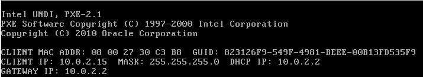

.. _IPv6_configuration:

==================
IPv6 configuration
==================

.. Contents::

This page describes how we perform IPv6_ configuration.
Please see also the accompanying page about :ref:`IPv6_deployment` at the departmental (local network) level.

IPv6 information
================

Internet Protocol version 6 (IPv6_) is the latest revision of the Internet Protocol (IP), the communications protocol that routes traffic across the Internet. 

.. _IPv6: http://en.wikipedia.org/wiki/Ipv6

General books about IPv6_ can be searched at `Amazon <http://www.amazon.co.uk/s/ref=nb_sb_noss_1?url=search-alias%3Dstripbooks&field-keywords=ipv6>`_.

Internet pages discussing IPv6:

* `Linux IPv6 HOWTO <http://www.tldp.org/HOWTO/Linux+IPv6-HOWTO/>`_
* `Why is IPv6 Important? <http://technet.microsoft.com/en-us/library/bb726954.aspx>`_ (Microsoft)
* `IPv6 for Microsoft Windows: Frequently Asked Questions <http://technet.microsoft.com/en-us/network/cc987595.aspx>`_
* IPv6 `Link-local address <http://en.wikipedia.org/wiki/Link-local_address>`_

IPv6 addressing
---------------

An IPv6_ address consists of exactly 8 *quartets* (i.e., 4 hexadecimal digits) separated by : characters.
The notation :: signifies one or more quartets containing zeroes (can be used only once in an address).
Read more about IPv6_addressing_.

.. _IPv6_addressing: http://www.ipv6.com/articles/general/IPv6-Addressing.htm

Usually a /64 (64 bits out of 128) subnet is allocated to the departmental level, for example::

  2001:0878:0200::/48       (university level)
  2001:0878:0200:xxxx::/64  (department level)

Router Advertisements
---------------------

In order for IPv6 to function, Router_Advertisement_ (RA) is required by our routers to advertise to hosts on our local network basic information about the IPv6 network prefix and the default gateway address.
RAs are part of the *Neighbor Discovery Protocol* [NDP_][RFC4861_]:

* RA: used by routers to advertise their presence together with various link and Internet parameters.
* The *Neighbor Discovery protocol* [RFC4861_] describes the operation of IPv6 Router Advertisements (RAs) that are used to determine node configuration information during the IPv6 autoconfiguration process, 
  whether that node's configuration is stateful, via the Dynamic Host Configuration Protocol for IPv6 (DHCPv6) [RFC3315_] or stateless, 
  as per [RFC4862_], possibly in combination with DHCPv6 Light [RFC3736_].

There is a good description of `IPv6 Neighbor Discovery <http://packetlife.net/blog/2008/aug/28/ipv6-neighbor-discovery/>`_.

.. _Router_Advertisement: http://www.networksorcery.com/enp/protocol/icmp/msg9.htm
.. _NDP: http://en.wikipedia.org/wiki/Neighbor_Discovery_Protocol

There may be possible security/functionality issues with RAs, see *Rogue IPv6 Router Advertisement Problem Statement* [RFC6104_].

.. _RFC6104: http://tools.ietf.org/html/rfc6104
.. _RFC4861: http://tools.ietf.org/html/rfc4861
.. _RFC3315: http://tools.ietf.org/html/rfc3315
.. _RFC4862: http://tools.ietf.org/html/rfc4862
.. _RFC3736: http://tools.ietf.org/html/rfc3736
.. _RFC6275: http://tools.ietf.org/html/rfc6275

There is an IETF_ effort under way to add route information to DHCPv6_, see `DHCPv6 Route Options draft-ietf-mif-dhcpv6-route-option-05 <http://tools.ietf.org/html/draft-ietf-mif-dhcpv6-route-option-05>`_,
but there is currently (2013) no such standard.

To monitor the network for RAs from a Linux host use this command::

  tcpdump icmp6 | grep advertise

To capture RA packets on the net using Wireshark_, start the *Capture* process, then enter the following *Filter* for this type of packet::

  icmpv6.nd.ra.flag 

To install Wireshark_ on RPM-based Linux distributions::

  yum install wireshark-gnome

(or possibly ``wireshark-gtk+``).

.. _Wireshark: http://www.wireshark.org/

On Linux hosts you can display the IPv6 routing information by either of these commands::

  /sbin/ip -6 route show [dev <device>]
  /sbin/route -A inet6 

Router Advertisement flags
..........................

NDP_ Router_Advertisement_ messages contains several one-bit flags, see *IPv6 Router Advertisement Flags Option* RFC5175_ (section 3).
Of particular relevance are:

* M - **Managed Address Configuration** Flag [RFC4861_] implies the use of DHCPv6_.
* O - **Other Configuration** Flag [RFC4861_] implies that *Other configuration information* such as DNS should be obtained by DHCPv6_.
  If the M flag is set, the O flag is redundant and can be ignored because DHCPv6 will return all available configuration information. 

.. _RFC5175: http://tools.ietf.org/html/rfc5175

RA messages may include `prefix information <http://tools.ietf.org/html/rfc4861#section-4.6.2>`_.
Each prefix has L and A flags:

* L – **On-Link** Flag. The prefix can be used for on-link determination (other IPv6 addresses with the same prefix are on the same L2 subnet).
* A – **Autonomous** Address Configuration Flag. The prefix can be used for stateless address configuration (SLAAC), see RFC4862_.
* R – **Router Address** flag.  When set, indicates that the Prefix field contains a complete IP address assigned to the sending router, see RFC6275_.

For further details see IPv6 Router_Advertisements_Deep_Dive_ and Managed-Config-Flag_is_just_a_hint_ (contains Cisco IOS config information).

.. _Router_Advertisements_Deep_Dive: http://blog.ioshints.info/2012/11/ipv6-router-advertisements-deep-dive.html
.. _Managed-Config-Flag_is_just_a_hint: http://blog.ioshints.info/2012/01/ipv6-nd-managed-config-flag-is-just.html

IPv4-mapped IPv6 addresses
--------------------------

Hybrid dual-stack IPv6_/IPv4_ implementations recognize a special class of addresses, the IPv4-mapped IPv6 addresses. 
In these addresses, the first 80 bits are zero, the next 16 bits are one, and the remaining 32 bits are the IPv4 address. 
One may see these addresses with the first 96 bits written in the standard IPv6 format, and the remaining 32 bits written in the customary dot-decimal notation of IPv4. 

For example, ::ffff:192.0.2.128 represents the IPv4 address 192.0.2.128.

See http://en.wikipedia.org/wiki/Ipv6#IPv4-mapped_IPv6_addresses

.. _IPv4: http://en.wikipedia.org/wiki/Ipv4

DTU IPv6 network
================

The Danish *DeIC/Forskningsnettet* has a page about its `DeIC IPv6 network <http://www.deic.dk/IPv6>`_.

The central DTU backbone as well as DTU Wireless networks already implement IPv6_.
DTU's IPv6_ network is::

  2001:0878:0200::/48 DTU 

see `Allocated IPv6 addresses within DeIC <http://www.deic.dk/ipv6all>`_.

IPv6 on Windows
===============

See `IPv6 for Microsoft Windows: Frequently Asked Questions <http://technet.microsoft.com/en-us/network/cc987595.aspx>`_.

What versions of Windows provide support for IPv6?::

  Windows 7, Windows Server 2008 R2, Windows Vista, and Windows Server 2008 provide an IPv6 protocol stack and system-side IPv6 support for built-in applications and system services. The IPv6 protocol stack in these versions of Windows is an integrated IPv4 and IPv6 implementation known as the Next Generation TCP/IP stack. For more information, see Next Generation TCP/IP Stack in Windows Vista and Windows Server 2008.

  Microsoft also provides a supported IPv6 protocol stack for Windows Server 2003, Windows XP with Service Pack 1 (SP1) or later, and Windows CE .NET 4.1 or later. However, these operating systems have very limited IPv6 support for built-in applications and system services and are not recommended for an IPv6 deployment. 

Disabling IPv6 on Windows
-------------------------

See `How to disable IP version 6 or its specific components in Windows <http://support.microsoft.com/kb/929852>`_.
This page has *Fix it Solutions* to enable or to disable IPv6 or to selectively enable or disable components of IPv6 automatically. 

IPv6 on Raspberry Pi Raspbian "wheezy"
======================================

The Raspberry_pi_ device with Raspbian_ "wheezy" doesn't enable IPv6 by default, but there is a well-known procedure at http://www.raspberrypi.org/phpBB3/viewtopic.php?f=66&t=15886.

.. _Raspberry_pi: http://en.wikipedia.org/wiki/Raspberry_pi
.. _Raspbian: http://www.raspbian.org/

Add the text ``ipv6`` to ``/etc/modules``, then reboot the computer.
Loading ipv6 consumes 300K of RAM.
Only the *Link Local* IPv6 address will become enabled.

Configuring DHCPv6 client
-------------------------

The Raspbian_ "wheezy" IPv6 network interface does unfortunately **not** include a DHCPv6 client for dynamically managed addresses.
A working method for Debian Linux is described in http://www.rjsystems.nl/en/2100-dhcpv6-stateful-autocfg.php

This will install the package *wide-dhcpv6-client*, and furthermore some configuration files need to be edited.
There is a WIDE_DHCPv6_ homepage.

.. _WIDE_DHCPv6: http://sourceforge.net/projects/wide-dhcpv6/

IPv6 on RHEL5/CentOS5
=====================

To enable IPv6_ on RHEL5/CentOS5 see:

* http://www.allthingsdigital.nl/2011/02/27/configuring-red-hat-enterprise-linux-5-or-centos-5-for-ipv6/
* http://www.cyberciti.biz/faq/rhel-redhat-fedora-centos-ipv6-network-configuration/

You have to add to ``/etc/sysconfig/network``::

  NETWORKING_IPV6=yes

and configure the *eth0* (say) interface file ``/etc/sysconfig/network-scripts/ifcfg-eth0`` for some manual addresses (xxx)::

  IPV6INIT=yes
  IPV6ADDR=xxx
  IPV6_DEFAULTGW=xxx

The IPv6 configuration parameters are listed in ``/etc/sysconfig/network-scripts/ifup-ipv6``::

  # Uses following information from "/etc/sysconfig/network":
  #  NETWORKING_IPV6=yes|no: controls IPv6 initialization (global setting)
  #  IPV6_DEFAULTDEV=<device>: controls default route (optional)
  #  IPV6_DEFAULTGW=<address>: controls default route (optional)
  #
  # Uses following information from "/etc/sysconfig/network-scripts/ifcfg-$1":
  #  IPV6INIT=yes|no: controls IPv6 configuration for this interface
  #  IPV6ADDR=<IPv6 address>[/<prefix length>]: specify primary static IPv6 address
  #  IPV6ADDR_SECONDARIES="<IPv6 address>[/<prefix length>] ..." (optional)
  #  IPV6_ROUTER=yes|no: controls IPv6 autoconfiguration (no: multi-homed interface without routing)
  #  IPV6_AUTOCONF=yes|no: controls IPv6 autoconfiguration
  #   defaults:
  #    IPV6FORWARDING=yes: IPV6_AUTOCONF=no, IPV6_ROUTER=yes
  #    IPV6FORWARDING=no: IPV6_AUTOCONF=yes
  #  IPV6_MTU=<MTU for IPv6>: controls IPv6 MTU for this link (optional)
  #  IPV6_PRIVACY="rfc3041": control IPv6 privacy (optional)
  #    This script only supports "rfc3041" (if kernel supports it)

DHCPv6 client on RHEL5/CentOS5
------------------------------

To be written.

DHCPv6 service
==============

DHCPv6_ is a network protocol that is used for configuring IPv6_ hosts with IP addresses, IP prefixes and/or other configuration required to operate on an IPv6_ network.

DHCPv6_ uses UDP **port number 546** for clients and **port number 547** for servers.

It is required to run a DHCPv6_ server on the local subnet, even if client addresses are auto-configured.
At a minimum, addresses of IPv6_ DNS recursive resolver servers must be provided to clients by the DHCPv6_ server.

.. _DHCPv6: http://en.wikipedia.org/wiki/DHCPv6

DHCPv6 address assignment
-------------------------

The host IPv6_ address and DNS information may be assigned by *Router Advertisements* and/or a DHCPv6_ server.
How this happens on various host operating systems is **really confusing** as discussed in this paper:

* `IPv6 Router Advertisement Flags, RDNSS and DHCPv6 Conflicting Configurations <http://www.insinuator.net/2015/03/ipv6-router-advertisement-flags-rdnss-and-dhcpv6-conflicting-configurations/>`_.

There are some other interesting papers:

* Managed-Config-Flag_is_just_a_hint_.
* Router_Advertisements_Deep_Dive_.

Probably the correct (or optimal) DHCPv6_ address assignment method must be combined with the following *Router Advertisements* configuration:

* **M** flag is on.
* **O** flag is on.
* **A** flag is on.
* **L** flag is on.
* **No prefix** advertisement.

However, client OSes such as Android may not behave correctly when managed by DHCPv6_, see the above paper.

For example, for a Cisco router's subnet xx:yy:zz:ww::/64 the configuration of RA flags may be::

    ipv6 nd prefix xx:yy:zz:ww::/64 no-advertise
    ipv6 nd managed-config-flag
    ipv6 nd other-config-flag
    ipv6 nd router-preference High

In the ``ipv6 nd prefix`` command the A and L flags are on (=1) by default (can be changed by the no-autoconfig and no-onlink flags).
See this `Cisco IOS IPv6 Command Reference <http://www.cisco.com/c/en/us/td/docs/ios-xml/ios/ipv6/command/ipv6-cr-book/ipv6-i3.html#wp1103499300>`_.

DHCPv6 documentation
--------------------

* A good general discussion is `DHCPv6 – an introduction to the new host configuration protocol <http://ipv6friday.org/blog/2011/12/dhcpv6/>`_.

* `DHCPv6 – a presentation <http://www.nanog.org/meetings/nanog45/presentations/Tuesday/Brzozow_dhcpv6_v7_N45.pdf>`_ by John Jason Brzozowski - very detailed.

* xCat_DHCPv6_management_ (discusses usage of DUID_ and UUID_)

* `IPv6 - Auto Configuration vs DHCPv6 <http://www.ipv6.com/articles/general/Auto-Configuration-vs-DHCPv6.htm>`_ (IPv6.com_ Tech Spotlight).

* `DHCPv6 discussions <http://www.insinuator.net/tag/dhcpv6/>`_.

* `IPv6 Router Advertisement Flags, RDNSS and DHCPv6 Conflicting Configurations <http://www.insinuator.net/2015/03/ipv6-router-advertisement-flags-rdnss-and-dhcpv6-conflicting-configurations/>`_.

* `I Don’t Have Any Neighbors – A Deep Dive into DHCPv6, Part 1 <http://www.insinuator.net/2014/10/i-dont-have-any-neighbors-a-deep-dive-into-dhcpv6-part-1/>`_ 
  and `Router Advertisement Options to the Rescue – A Deep Dive into DHCPv6, Part 2 <http://www.insinuator.net/2014/10/router-advertisement-options-to-the-rescue-a-deep-dive-into-dhcpv6-part-2/>`_.

.. _xCat_DHCPv6_management: http://sourceforge.net/apps/mediawiki/xcat/index.php?title=DHCPv6_management
.. _DHCP_Surprises: http://blog.geoff.co.uk/2011/07/08/dhcpv6-surprises/
.. _IPv6.com: http://www.ipv6.com/

Defining documents are in the IETF_ RFCs:

  * RFC3315_: Dynamic Host Configuration Protocol for IPv6 (DHCPv6)
  * RFC4361_: Using DUIDs in DHCP for IPv4_
  * RFC6355_: Definition of the UUID-Based DHCPv6 Unique Identifier (DUID-UUID)
  * RFC6939_: Client Link-Layer Address Option in DHCPv6 (defining a new DHCPv6 option in 2013).

.. _IETF: http://www.ietf.org/
.. _RFC4361: http://tools.ietf.org/html/rfc4361
.. _RFC6355: http://tools.ietf.org/html/rfc6355
.. _RFC6939: https://tools.ietf.org/rfc/rfc6939

For multiple subnets or VLANs there unfortunately doesn't exist any *DHCPv6 relay agent* similarly to the DHCPv4 relay agent (RFC2131_) case.
However, there exists an IETF draft `Client Link-layer Address Option in DHCPv6 <http://tools.ietf.org/html/draft-ietf-dhc-dhcpv6-client-link-layer-addr-opt-05>`_ 
which attempts to create a future standard for *DHCPv6 relay agent*.

.. _RFC2131: http://tools.ietf.org/html/rfc2131

DHCPv6 server software
----------------------

There are several implementations of DHCPv6 servers:

* The ISC_DHCP_ software (see ISC_DHCP_documentation_) is the most widely used open source DHCP implementation on the Internet. 

* The dhcpy6d_ open source server for DHCPv6_. Can use MAC-addresses for client identification.

* The Dibbler_ portable DHCPv6 implementation.

* Discussions about the Microsoft_DHCPv6_ server:

  * `How to install a DHCP server for IPv6 (DHCPv6) on Windows Server 2008 R2 <http://4sysops.com/archives/how-to-install-a-dhcp-server-for-ipv6-dhcpv6-on-windows-server-2008-r2/>`_
  * `DHCPv6 - Understanding of address configuration in automatic mode and installation of DHCPv6 Server <http://blogs.technet.com/b/teamdhcp/archive/2009/03/03/dhcpv6-understanding-of-address-configuration-in-automatic-mode-and-installation-of-dhcpv6-server.aspx>`_

.. _ISC_DHCP: http://www.isc.org/software/dhcp
.. _ISC_DHCP_documentation: http://www.isc.org/software/dhcp/documentation
.. _ISC_DHCP_HowTo: http://www.tldp.org/HOWTO/Linux+IPv6-HOWTO/hints-daemons-isc-dhcp.html
.. _ISC_DHCP_hints: http://www.tldp.org/HOWTO/Linux+IPv6-HOWTO/hints-daemons-dhcpv6..html
.. _dhcpy6d: http://dhcpy6d.ifw-dresden.de/
.. _Dibbler: http://klub.com.pl/dhcpv6/
.. _Microsoft_DHCPv6: http://technet.microsoft.com/en-us/windowsserver/dd448608.aspx

DHCPv6 Unique IDentifier (DUID)
-------------------------------

The *DHCP Unique Identifier* (DUID_) is defined by RFC3315_ (section 9).
It is used by a DHCPv6_ servers and clients as part of the IPv6_ address assignment process.

.. _DUID: http://en.wikipedia.org/wiki/DHCPv6#DHCP_Unique_Identifier

You can no longer simply use the MAC address of an interface to assign a fixed IP address via DHCPv6_. 
However, you **can use MAC-addresses as client identifiers** if you deploy the dhcpy6d_ open source server for DHCPv6_.
Please read the sections on dhcpy6d_ below.

RFC3315_ (section 11) lists the client information which may be used, the DUID_ being one of them.
Unlike DHCPv4, in which the MAC address of the client interface is included in a DHCP request, DHCPv6 may use a DHCP Unique Identifier, or DUID_, to uniquely identify the client. 
The same DUID_ is used by the system regardless of which interface a DHCPv6_ message originates from.

DUID on Windows 7
.................

Windows 7 can display its DHCPv6 DUID_ in a command window::

  ipconfig /all
  ...
  Ethernet adapter Local Area Connection:
  ...
  DHCPv6 Client DUID. . . . . . . . : 00-01-00-01-16-C1-BA-6E-08-00-27-30-C3-B8

DUID on Fedora Linux
....................

Recent Fedora versions use NetworkManager_ for network interface management.
The DUID_ will be generated by NetworkManager_ and stored as a line in some DHCP lease file in one of these files::

  /var/lib/dhclient/dhclient6.leases
  /var/lib/NetworkManager/dhclient6-*.lease

For example (please note that the ISC dhclient6 stores the DUID_ value in a binary representation)::

  default-duid "\000\001\000\001\031\012D\036<\331+m3\004";

From `NetworkManager 0.9.7.997 Released with Minor Fixed <http://thelinuxsite.wordpress.com/2013/02/11/networkmanager-0-9-7-997-released-with-minor-fixed/>`_ (Fedora 18 and onwards)
the DHCPv6 DUID_ will be generated using the machine identifier file ``/etc/machine-id`` as input, in stead of the *dhclient* DHCPv6 client daemon.

.. _NetworkManager: http://en.wikipedia.org/wiki/NetworkManager

UUID-Based DHCPv6 Unique Identifier (DUID-UUID)
...............................................

If a long-term stable hardware identifier is required, the DUID_ could be configured using the UUID_-Based DHCPv6 Unique Identifier (DUID-UUID) which has been assigned **DUID Type 4** by RFC6355_::

  This document defines a new DHCPv6 Unique Identifier (DUID) type called DUID-UUID.
  DUID-UUIDs are derived from the already-standardized Universally Unique IDentifier (UUID) format.
  DUID-UUID makes it possible for devices to use UUIDs to identify themselves to DHC servers and vice versa.
  UUIDs are globally unique and readily available on many systems, making them convenient identifiers to leverage within DHCP.

.. _UUID: http://en.wikipedia.org/wiki/Universally_unique_identifier

Thus the system's RFC6355_ DUID-UUID value must have a 2-byte value of *4* (i.e., ``0004``) followed by the 32-byte (128-bit) hardware UUID_::

  0004<UUID>

The system's UUID_ can be found by these commands:

.. list-table::
  :widths: 2 4

  * - Linux
    - ``dmidecode | grep UUID``
  * - RHEL, Fedora
    - ``cat /sys/devices/virtual/dmi/id/product_uuid``
  * - Windows
    - ``WMIC CSPRODUCT``
  * - ESXi
    - ``vsish -e get /hardware/machineUUID``

The DHCPv6 DUID_ based upon the UUID may be configured as in the examples in xCat_DHCPv6_management_.

Intel's Ethernet PXE_ booting uses a GUID_ (a synonym for UUID_) which might be useful for network booting.
The PXE GUID_/UUID_ is defined in Intel's PXE_specification_ document, 
and its hexadecimal value is usually displayed next to the Ethernet MAC address on a PC's PXE network boot screen, for example:

For the hardware GUID in this figure (823126F9-549F-4981-BEEE-00B13FD535F9) the RFC6355_ DUID-UUID would become in hexadecimal representation::

  0004823126F9549F4981BEEE00B13FD535F9

PXE-booting and GUID/UUID
.........................

The PXElinux_ page explains how the BIOS PXE_ booting uses TFTP to download configuration files.
The first file name being tried is the value of the GUID_/UUID_, so that PXE_ boot actions can be configured based upon this value.

.. _PXE: http://en.wikipedia.org/wiki/Preboot_Execution_Environment
.. _PXE_specification: http://download.intel.com/design/archives/wfm/downloads/pxespec.pdf
.. _GUID: http://en.wikipedia.org/wiki/Globally_Unique_Identifier
.. _PXElinux: http://www.syslinux.org/wiki/index.php/Doc/pxelinux

Firewall rules for the DHCPv6 server
====================================

In order for the server to receive DHCPv6_ requests from the network, the iptables firewall must allow UDP port 547:

* RHEL7/CentOS7: Using firewalld_ open the dhcpv6 service port 547/udp::

    firewall-cmd --zone=public --add-service=dhcpv6 --permanent
    firewall-cmd --reload

  List the opened services, for example::

    # firewall-cmd --list-services
    dhcpv6-client dhcpv6 ssh

  For further information see http://www.firewalld.org/documentation/howto/open-a-port-or-service.html

.. _firewalld: https://fedoraproject.org/wiki/FirewallD

From a remote host you can port-scan the server's port 547/udp with nmap_::

  nmap -O -6 -p 547 -sU <server>

.. _nmap: https://nmap.org/

dhcpy6d DHCPv6 server
=====================

dhcpy6d_ is an open source server for DHCPv6, the DHCP protocol for IPv6_.
Its development is driven by the need to be able to use the existing IPv4_ infrastructure in coexistence with IPv6_. 
In a dualstack scenario, the existing DHCPv4 most probably uses MAC addresses of clients to identify them. 
This is not intended by RFC3315_ for DHCPv6, but also not forbidden. 
dhcpy6d_ is able to do so in local network segments and therefore offers a pragmatical method for parallel use of DHCPv4 and DHCPv6, because existing client management solutions could be used further.

Installation on RHEL7/CentOS7
-----------------------------

* Install DNS and database support::

    yum install python-dns sqlite MySQL-python 

* Download the latest dhcpy6d-XXX.el7.centos.noarch.rpm **el7** RPM package from http://dhcpy6d.ifw-dresden.de/download/ and install it::

    yum install dhcpy6d-*.el7.centos.noarch.rpm

Configuring dhcpy6d
-------------------

Please consult the dhcpy6d_configuration_ page.
The configuration file is ``/etc/dhcpy6d.conf``.
We have chosen a simple text file ``/etc/dhcpy6d-clients.conf`` for client definitions and a simple SQLite_ database for the DHCP leases.

.. _dhcpy6d_configuration: http://dhcpy6d.ifw-dresden.de/documentation/config/
.. _SQLite: http://en.wikipedia.org/wiki/SQLite

Starting the dhcpy6d service
----------------------------

When you have completed the dhcpy6d_configuration_, add the dhcpy6d_ service:

* RHEL7/CentOS7::

    systemctl enable dhcpy6d
    systemctl start dhcpy6d

  When it's completely tested, make sure dhcpy6d_ starts at boot time::

    chkconfig dhcpy6d on

Leases database in dhcpy6d
--------------------------

The dhcpy6d leases database is described in dhcpy6d_configuration_.

If using an SQLite_ database, its contents can be dumped to stdout by::

  sqlite3 /var/lib/dhcpy6d/volatile.sqlite .dump

so that you can view the DHCP leases in the database.
SQLite_ commands are described in `Command Line Shell For SQLite <http://www.sqlite.org/sqlite.html>`_.

Managing DHCPv6 clients with the ISC DHCPv6 server
--------------------------------------------------

In many organizations the ability to identify client computers on the network will be required for IT security reasons.
Therefore we want to restrict our DHCP servers so that they grant addresses only to registered and authorized client computers.
In the ISC_DHCP_ server this is done in the configuration file (see ``man dhcpd.conf``) by::

  deny unknown-clients;

Linux DHCP clients and /etc/resolv.conf
=======================================

On UNIX and Linux hosts, the DHCPv6 client instance has to run as a separate process from the DHCPv4 one, and the two processes race each other to update the /etc/resolv.conf file.
The *NetworkManager* should handle this correctly (testing needed).
